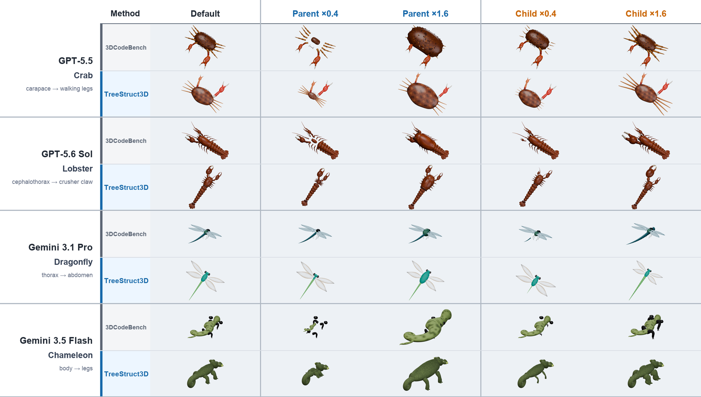
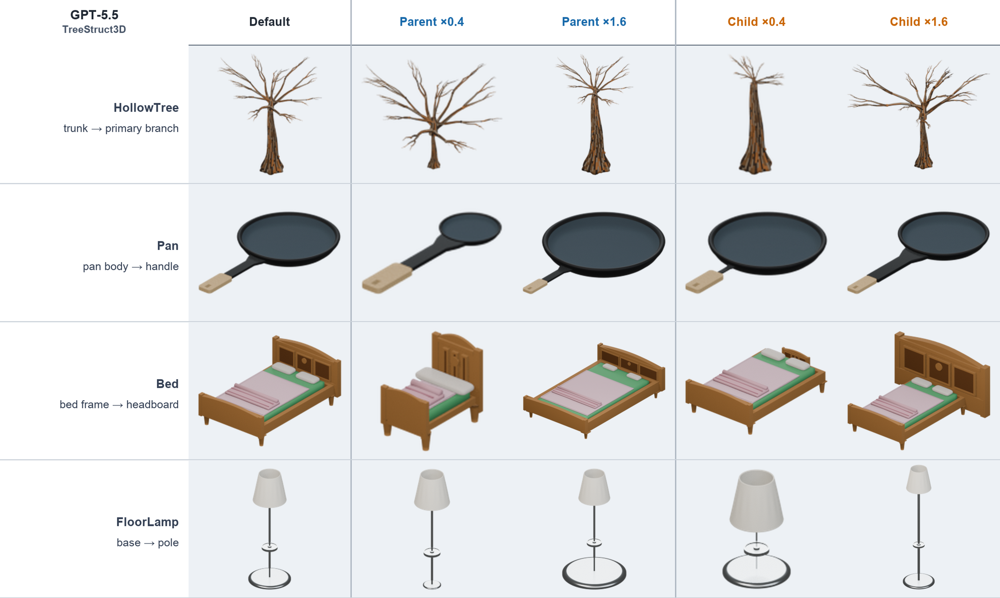
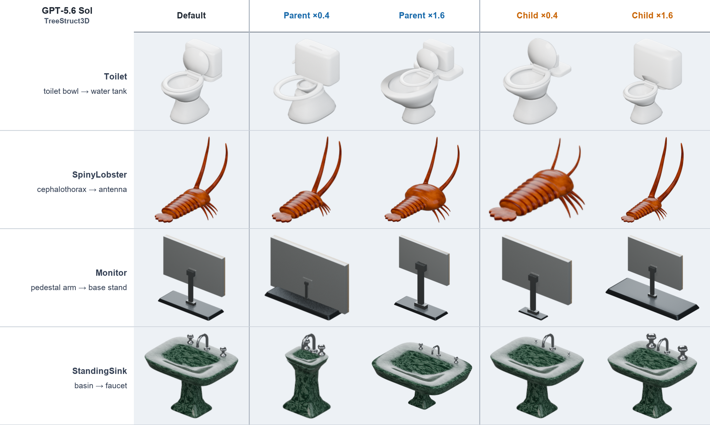
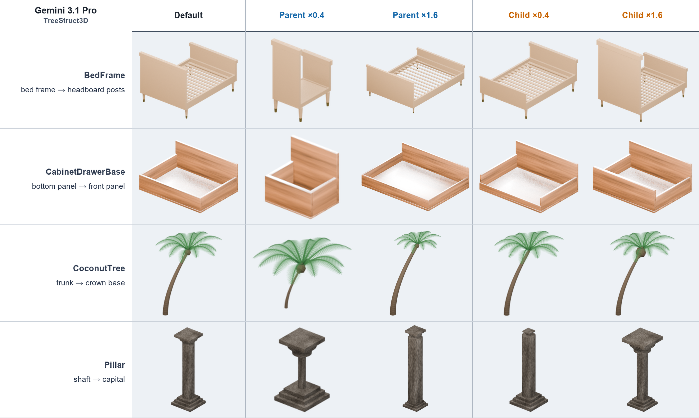
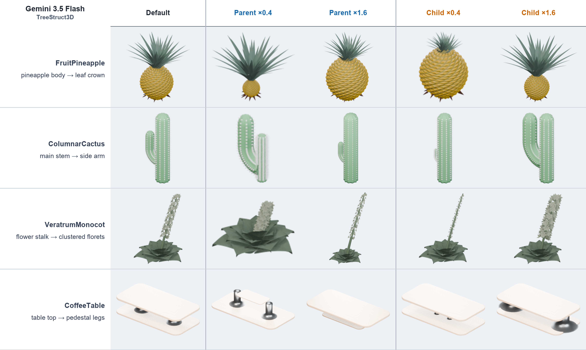

# TreeStruct3D: Enabling Structural Editability in Agentic Procedural 3D Modeling

TreeStruct3D is a structure-aware system for generating editable procedural 3D
assets as Blender Python programs. It represents an object as a directed tree
of semantic parts, realizes each parent-child attachment with geometry-derived
shared anchors, and verifies that those attachments survive controlled edits to
the generated part parameters.

This repository is the official implementation of the research project
**TreeStruct3D: Enabling Structural Editability in Agentic Procedural 3D
Modeling**.

## Controlled editing at a glance



*Figure 1. Each pair compares 3DCodeBench and TreeStruct3D in the default,
parent-rescaled, and child-rescaled configurations. The 0.4× and 1.6× scales
are qualitative stress tests; quantitative evaluation uses 0.8× and 1.2×.*

## What TreeStruct3D does

1. Extracts a connected part-and-attachment blueprint from an object
   description.
2. Supplies that blueprint to a Blender code-generation model without exposing
   the benchmark reference program.
3. Executes and renders the generated program in Blender.
4. Validates semantic parts, hierarchy, contact, shared anchors, and behavior
   under parent and child parameter edits.
5. Returns localized failures for structural repair before visual refinement.

The active experimental pipeline and model-facing prompt behavior are frozen.
Refactoring must preserve their behavior; see
[CONTRIBUTING.md](CONTRIBUTING.md).

## Repository layout

TreeStruct3D is maintained as one monorepo with two top-level components:

```text
TreeStruct3D/          generation, rendering, repair, and evaluation pipeline
visual_validation/    visual validation and interactive inspection toolkit
```

The repository and its primary pipeline share the name `TreeStruct3D`. The
inner `TreeStruct3D/` directory denotes the generation component, while the
repository root integrates generation and validation. The
`visual_validation/` component provides interactive inspection together with
the automated structural checks used by the pipeline.

Detailed component documentation is available in
[TreeStruct3D/README.md](TreeStruct3D/README.md) and
[visual_validation/README.md](visual_validation/README.md).

## Requirements

- Python 3.9 or newer
- Blender 5.0 for execution, rendering, and runtime structural checks
- Git LFS for the validation assets stored in this repository
- Node.js for the frontend JavaScript regression tests
- Access to a supported model API for end-to-end generation

Clone the repository with its LFS objects and create a virtual environment:

```bash
git lfs install
git clone https://github.com/RichardFeng000/TreeStruct3D.git
cd TreeStruct3D
python3 -m venv .venv
source .venv/bin/activate
python -m pip install -r TreeStruct3D/requirements.txt
```

Unit tests do not call model APIs or launch Blender:

```bash
(cd TreeStruct3D && python -m unittest discover -s tests -v)
(cd visual_validation && python -m unittest discover -s tests -v)
```

## Benchmark input data

TreeStruct3D uses the 212-category `3DCodeBench/` evaluation split from the
official [YipengGao/3DCode dataset](https://huggingface.co/datasets/YipengGao/3DCode).
The corresponding evaluation code is maintained in the
[3DCodeBench repository](https://github.com/gaoypeng/3dcodebench).

For reproducibility, this repository already includes a byte-identical copy of
all 636 files from the upstream `3DCodeBench/` split at Hugging Face revision
[`c2bcae4f36d6fe19e794b85695d430ce0210f92d`](https://huggingface.co/datasets/YipengGao/3DCode/tree/c2bcae4f36d6fe19e794b85695d430ce0210f92d/3DCodeBench)
under `TreeStruct3D/benchmark/categories/`. A separate dataset download is
therefore not required for the default examples.

By default, the model-facing stages read only each instance's
`prompt_description.txt`. Passing `--prompt-type instruction` selects
`prompt_instruction.txt` instead. The colocated reference Blender `.py` file
is retained for provenance and evaluation; neither structure extraction nor
generation reads it as model input.

See [TreeStruct3D/benchmark/README.md](TreeStruct3D/benchmark/README.md) for the
pinned download command, directory schema, input boundary, and data licenses.

## Quick start

Create a local configuration from the tracked example and provide credentials
through an environment variable:

```bash
cp TreeStruct3D/configs/config.example.yaml TreeStruct3D/config.local.yaml
export TREESTRUCT3D_API_KEY=your-api-key
```

Set the required `api_format`, `api_url`, and `model` values in
`TreeStruct3D/config.local.yaml` before running either phase.

The selected YAML is the single source for all model API and request-policy
settings; neither model-facing command accepts command-line overrides for
them. See the
[configuration reference](TreeStruct3D/docs/CONFIGURATION.md) for the complete
schema and provider examples.

Extract a structure blueprint and generate one Blender program:

```bash
cd TreeStruct3D
./extract_structure.sh \
  --config config.local.yaml \
  --instances Bird_seed0 \
  --overwrite
./generate_3d.sh \
  --config config.local.yaml \
  --instances Bird_seed0 \
  --overwrite \
  --render-samples 16 \
  --render-resolution 256
```

TreeStruct3D resolves the validator from the sibling `visual_validation/`
directory by default. The paths can also be selected explicitly:

```bash
export TREESTRUCT3D_BLENDER=/absolute/path/to/blender
export TREESTRUCT3D_VALIDATOR_ROOT=/absolute/path/to/visual_validation
```

Launch the local visual-validation interface from the repository root:

```bash
./visual_validation/start_model_playground.sh
```

End-to-end generation can use paid APIs and Blender. Review the component
documentation and configuration before starting a full run.

## Stable public terminology

- Project and repository: `TreeStruct3D`
- Python package: `treestruct3d`
- Structure artifact: **structure blueprint**
- Directed relation: **attachment**
- Geometry-derived dependency: **shared anchor**
- Validation component: **TreeStruct3D Visual Validation Toolkit**

Historical names such as `StructGen3D3.0` and `Stage 7` are retained only in
migration documentation and compatibility readers. New code, artifacts, and
documentation must use the stable names above.

## Data and generated outputs

The committed validation assets use Git LFS. Generated model responses,
renders, local caches, API credentials, and experiment outputs must not be
committed unless they are deliberately prepared as a documented release
artifact.

## Provenance and license

TreeStruct3D builds on the benchmark, generation setup, and rendering utilities
introduced by [3DCodeBench](https://github.com/gaoypeng/3dcodebench). The
upstream Blender generation system prompt is retained byte-for-byte for
controlled comparison. See [NOTICE](NOTICE) and
[THIRD_PARTY_NOTICES.md](THIRD_PARTY_NOTICES.md) for attribution and the
separate licenses that apply to the benchmark text and reference factories.

The project is distributed under the Apache License 2.0. See
[LICENSE](LICENSE).

## Appendix: Qualitative editing gallery

The complete four-panel appendix gallery is shown below in paper order. Each
row compares the default asset with exaggerated 0.4× and 1.6× parent- and
child-side edits; row labels inside the panels identify the edited attachment.

### (a) GPT-5.5



### (b) GPT-5.6 Sol



### (c) Gemini 3.1 Pro



### (d) Gemini 3.5 Flash



*Figure 6. Selected TreeStruct3D examples. The four panels are qualitative
stress tests; every depicted attachment passes the post-hoc contact checks at
0.8× and 1.2×.*
