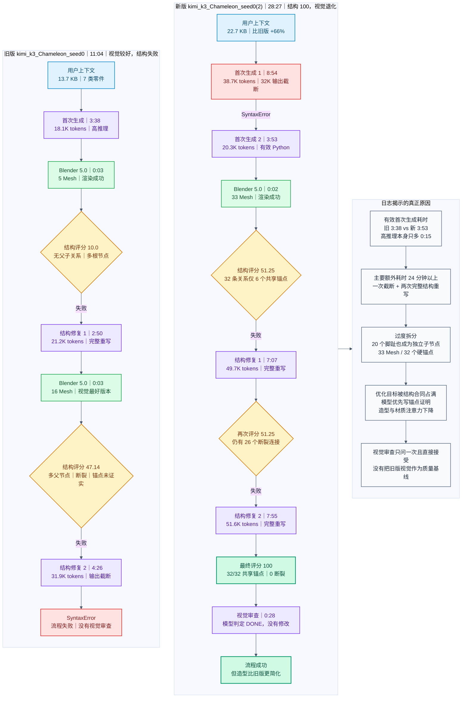

# Chameleon TreeStruct3D 日志流程对比

根据 `kimi_k3_Chameleon_seed0` 与 `kimi_k3_Chameleon_seed0(2)` 的真实 `flow.log`、API token 统计和结构评分生成。时间均为日志中相邻事件的实际耗时。

```mermaid
%%{init: {"theme": "base", "themeVariables": {"background": "#ffffff", "fontFamily": "Arial, PingFang SC, sans-serif", "primaryTextColor": "#172033", "lineColor": "#475569"}, "flowchart": {"curve": "linear", "nodeSpacing": 32, "rankSpacing": 42}}}%%
flowchart LR
    subgraph OLD["旧版 kimi_k3_Chameleon_seed0｜11:04｜视觉较好，结构失败"]
      direction TB
      O0["用户上下文<br/>13.7 KB｜7 类零件"]
      O1["首次生成｜3:38<br/>18.1K tokens｜高推理"]
      O2["Blender 5.0｜0:03<br/>5 Mesh｜渲染成功"]
      O3{"结构评分 10.0<br/>无父子关系｜多根节点"}
      O4["结构修复 1｜2:50<br/>21.2K tokens｜完整重写"]
      O5["Blender 5.0｜0:03<br/>16 Mesh｜视觉最好版本"]
      O6{"结构评分 47.14<br/>多父节点｜断裂｜锚点未证实"}
      O7["结构修复 2｜4:26<br/>31.9K tokens｜输出截断"]
      O8["SyntaxError<br/>流程失败｜没有视觉审查"]
      O0 --> O1 --> O2 --> O3
      O3 -->|失败| O4 --> O5 --> O6
      O6 -->|失败| O7 --> O8
    end

    subgraph NEW["新版 kimi_k3_Chameleon_seed0(2)｜28:27｜结构 100，视觉退化"]
      direction TB
      N0["用户上下文<br/>22.7 KB｜比旧版 +66%"]
      N1["首次生成 1｜8:54<br/>38.7K tokens｜32K 输出截断"]
      N2["首次生成 2｜3:53<br/>20.3K tokens｜有效 Python"]
      N3["Blender 5.0｜0:02<br/>33 Mesh｜渲染成功"]
      N4{"结构评分 51.25<br/>32 条关系仅 6 个共享锚点"}
      N5["结构修复 1｜7:07<br/>49.7K tokens｜完整重写"]
      N6{"再次评分 51.25<br/>仍有 26 个断裂连接"}
      N7["结构修复 2｜7:55<br/>51.6K tokens｜完整重写"]
      N8["最终评分 100<br/>32/32 共享锚点｜0 断裂"]
      N9["视觉审查｜0:28<br/>模型判定 DONE，没有修改"]
      N10["流程成功<br/>但造型比旧版更简化"]
      N0 --> N1
      N1 -->|SyntaxError| N2 --> N3 --> N4
      N4 -->|失败| N5 --> N6
      N6 -->|失败| N7 --> N8 --> N9 --> N10
    end

  subgraph WHY["日志揭示的真正原因"]
    direction TB
    D1["有效首次生成耗时<br/>旧 3:38 vs 新 3:53<br/>高推理本身只多 0:15"]
    D2["主要额外耗时 24 分钟以上<br/>一次截断 + 两次完整结构重写"]
    D3["过度拆分<br/>20 个脚趾也成为独立子节点<br/>33 Mesh / 32 个硬锚点"]
    D4["优化目标被结构合同占满<br/>模型优先写锚点证明<br/>造型与材质注意力下降"]
    D5["视觉审查只问一次且直接接受<br/>没有把旧版视觉作为质量基线"]
    D1 --> D2 --> D3 --> D4 --> D5
  end

  OLD ~~~ NEW
  NEW --> WHY

  classDef input fill:#E0F2FE,stroke:#0284C7,stroke-width:1.5px,color:#0C4A6E;
  classDef model fill:#EDE9FE,stroke:#7C3AED,stroke-width:1.5px,color:#4C1D95;
  classDef render fill:#DCFCE7,stroke:#16A34A,stroke-width:1.5px,color:#14532D;
  classDef decision fill:#FEF3C7,stroke:#D97706,stroke-width:1.5px,color:#78350F;
  classDef fail fill:#FEE2E2,stroke:#DC2626,stroke-width:1.5px,color:#7F1D1D;
  classDef success fill:#D1FAE5,stroke:#059669,stroke-width:2px,color:#064E3B;
  classDef diagnosis fill:#F8FAFC,stroke:#64748B,stroke-width:1.5px,color:#1E293B;

  class O0,N0 input;
  class O1,O4,O7,N1,N2,N5,N7,N9 model;
  class O2,O5,N3 render;
  class O3,O6,N4,N6 decision;
  class O8,N1 fail;
  class N8,N10 success;
  class D1,D2,D3,D4,D5 diagnosis;
```
